# 🤖 AI Office Pilot

```
╔══════════════════════════════════════════════════════════════════════════════╗
║                                                                              ║
║   ██████╗  ██████╗ ████████╗███████╗██╗     ███████╗ ██████╗ ██████╗  ██████╗ ║
║  ██╔════╝ ██╔═══██╗╚══██╔══╝██╔════╝██║     ██╔════╝██╔═══██╗██╔══██╗██╔═══██║
║  ██║  ███╗██║   ██║   ██║   █████╗  ██║     █████╗  ██║   ██║██████╔╝██║   ██║
║  ██║   ██║██║   ██║   ██║   ██╔══╝  ██║     ██╔══╝  ██║   ██║██╔══██╗██║   ██║
║  ╚██████╔╝╚██████╔╝   ██║   ███████╗███████╗███████╗╚██████╔╝██║  ██║╚██████╔║
║   ╚═════╝  ╚═════╝    ╚═╝   ╚══════╝╚══════╝╚══════╝ ╚═════╝ ╚═╝  ╚═╝ ╚═════╝
║                                                                              ║
║   ██████╗ ███████╗██╗   ██╗     ██████╗ ███████╗███████╗████████╗               ║
║  ██╔════╝ ██╔════╝██║   ██║     ██╔══██╗██╔════╝██╔════╝╚══██╔══╝               ║
║  ██║  ███╗█████╗  ██║   ██║     ██████╔╝█████╗  ███████╗   ██║                  ║
║  ██║   ██║██╔══╝  ██║   ██║     ██╔═══╝  ██╔══╝  ╚════██║   ██║                  ║
║  ╚██████╔╝███████╗██║   ██║     ██║     ███████╗███████║   ██║                  ║
║   ╚═════╝ ╚══════╝╚═╝   ╚═╝     ╚═╝     ╚══════╝╚══════╝   ╚═╝                  ║
║                                                                              ║
║        Your Private AI Assistant for Email, Files & Data                     ║
║                                                                              ║
║        🛡️ AES-256  │  🧠 Self-Learning  │  ☁️ 100% Local  │  📱 Web Dashboard ║
║                                                                              ║
╚══════════════════════════════════════════════════════════════════════════════╝
```

---

<p align="center">
  
  
  
  
  <a href="https://hub.docker.com/r/aiofficepilot/ai-office-pilot">
    
  </a>
  
</p>

---

## 📋 Table of Contents

- [🚀 About AI Office Pilot](#about)
- [✨ Why Choose Us](#why-choose-us)
- [📚 Version History](#version-history)
- [🏗️ Architecture](#architecture)
- [🚀 Quick Start](#quick-start)
- [🔐 Security](#security)
- [📖 Documentation](#documentation)
- [🛠️ Development](#development)
- [🐳 Docker](#docker)
- [🗺️ Roadmap](#roadmap)
- [🤝 Contributing](#contributing)
- [📄 License](#license)

---

## 🚀 About AI Office Pilot

AI Office Pilot is a **privacy-first, fully local AI assistant** that handles your email, files, and data entry automatically. Unlike cloud-based solutions, all processing happens on your machine using Ollama - ensuring your data never leaves your device.

### Key Features

| Feature | Description |
|---------|-------------|
| 📧 **Email Automation** | IMAP/SMTP integration with AI-powered classification and smart reply generation |
| 📁 **File Management** | Watch folders with AI content analysis and automatic organization |
| 📊 **Data Entry** | Extract invoice/receipt data to Excel, CSV, or Google Sheets |
| 🧠 **Self-Learning** | 5-layer memory system that learns from your corrections |
| 🔒 **Military-Grade Security** | AES-256 encryption with PBKDF2 key derivation |
| 🌐 **Web Dashboard** | Beautiful Flask-based UI for monitoring and control |
| ✅ **GDPR/HIPAA Compliant** | Full audit trail, data export, and deletion capabilities |

---

## ✨ Why Choose Us

```
┌────────────────────────────────────────────────────────────────────────────────┐
│                        WHY AI OFFICE PILOT?                                    │
├────────────────────────────────────────────────────────────────────────────────┤
│                                                                                │
│  🔒 PRIVACY FIRST                        ⚡ ALWAYS AVAILABLE                  │
│  Your data never leaves your machine    Works 100% offline                   │
│  Zero cloud dependencies                No internet required                  │
│                                                                                │
│  🧠 SELF-LEARNING                       💰 COST EFFECTIVE                     │
│  Gets smarter every day                 No subscription fees                  │
│  Learns your preferences                Open source forever                   │
│                                                                                │
│  🛡️ ENTERPRISE SECURITY                  🚀 EASY DEPLOYMENT                   │
│  AES-256, 2FA, Audit logs               Docker, local, or cloud               │
│  GDPR/HIPAA compliant                   Runs on any Linux machine             │
│                                                                                │
└────────────────────────────────────────────────────────────────────────────────┘
```

---

## 📚 Version History

### 🔵 Version 3.0 (Current) - "The Enterprise Edition"
**Release Date: March 2026**

Phase-by-phase features added in v3.0:

```
┌────────────────────────────────────────────────────────────────────────────────┐
│                           VERSION 3.0 FEATURES                               │
├────────────────────────────────────────────────────────────────────────────────┤
│                                                                                │
│  PHASE 1: TESTING & ERROR HANDLING                                            │
│  ├── Comprehensive test suite (138 tests, 135 passing)                      │
│  ├── Retry logic with exponential backoff for network operations             │
│  ├── Dead letter queue for failed operations                                 │
│  └── Proper error logging across all modules                                  │
│                                                                                │
│  PHASE 2: CODE QUALITY                                                         │
│  ├── Ruff code formatting across entire codebase                             │
│  ├── Type hints added to critical modules                                     │
│  └── Linting configuration with pyproject.toml                               │
│                                                                                │
│  PHASE 3: MISSING FEATURES                                                    │
│  ├── Email templates system (customizable reply templates)                    │
│  ├── Calendar integration (.ics file parsing & management)                  │
│  └── Meeting request automation                                              │
│                                                                                │
│  PHASE 4: DOCUMENTATION                                                       │
│  ├── Deployment guide (docs/DEPLOYMENT.md)                                   │
│  ├── API documentation (docs/API.md)                                         │
│  ├── Web dashboard landing page                                              │
│  └── Architecture documentation (ARCHITECTURE.md)                             │
│                                                                                │
│  PHASE 5: OPERATIONS                                                           │
│  ├── Log rotation (daily + size-based 10MB)                                   │
│  ├── Docker multi-stage build optimization                                    │
│  └── Health monitoring with Ollama status                                     │
│                                                                                │
│  PHASE 6: SECURITY ENHANCEMENTS                                                │
│  ├── Biometric unlock support (Windows Hello, Touch ID, PAM)                │
│  ├── Session management with refresh tokens                                  │
│  ├── Network isolation mode (normal/isolated/air-gapped)                    │
│  ├── VPN support with auto-connect                                           │
│  └── Configurable rate limiting via .env                                     │
│                                                                                │
└────────────────────────────────────────────────────────────────────────────────┘
```

### 🟢 Version 2.0 - "The Learning Edition"
**Release Date: 2025**

```
┌────────────────────────────────────────────────────────────────────────────────┐
│                           VERSION 2.0 FEATURES                               │
├────────────────────────────────────────────────────────────────────────────────┤
│                                                                                │
│  • Self-Learning Engine (5-layer memory system)                              │
│  ├── Feedback Loop - Learns from user corrections                            │
│  ├── Preference Capture - Stores user preferences                           │
│  ├── Style Learning - Mimics writing tone                                    │
│  ├── Pattern Recognition - Time-based behavior analysis                     │
│  └── Predictions - Anticipates next actions                                   │
│                                                                                │
│  • Enhanced Email Brain                                                       │
│  ├── Smart classification (URGENT, ROUTINE, SPAM, MEETING)                  │
│  ├── Intelligent reply drafting with learned style                           │
│  └── Contact learning and prioritization                                     │
│                                                                                │
│  • File Commander Pro                                                         │
│  ├── AI content analysis                                                      │
│  ├── Smart categorization                                                     │
│  └── Automatic organization                                                   │
│                                                                                │
│  • Data Engine                                                                │
│  ├── Invoice extraction                                                      │
│  ├── Receipt parsing                                                          │
│  └── Spreadsheet export (Excel, CSV, Google Sheets)                          │
│                                                                                │
└────────────────────────────────────────────────────────────────────────────────┘
```

### 🟢 Version 1.0 - "The Foundation"
**Release Date: 2024**

```
┌────────────────────────────────────────────────────────────────────────────────┐
│                           VERSION 1.0 FEATURES                               │
├────────────────────────────────────────────────────────────────────────────────┤
│                                                                                │
│  • Core Architecture                                                          │
│  ├── AIOfficePilot main orchestrator                                         │
│  ├── OllamaBrain LLM interface                                               │
│  ├── QueueManager (priority-based task processing)                           │
│  └── HealthMonitor (system resources)                                        │
│                                                                                │
│  • Security Layer                                                             │
│  ├── AES-256 encryption engine                                               │
│  ├── PBKDF2 key derivation (600K iterations)                                  │
│  ├── Access control & authentication                                         │
│  ├── Audit logging (tamper-proof hash chain)                                 │
│  └── Secure data deletion                                                    │
│                                                                                │
│  • Basic Modules                                                              │
│  ├── Email reader/sender (IMAP/SMTP)                                         │
│  ├── File watcher                                                             │
│  ├── Basic data extraction                                                   │
│  └── CLI interface                                                           │
│                                                                                │
│  • Compliance                                                                 │
│  ├── GDPR ready                                                              │
│  ├── HIPAA ready                                                             │
│  └── Audit trail                                                              │
│                                                                                │
└────────────────────────────────────────────────────────────────────────────────┘
```

---

## 🏗️ Architecture

```mermaid
graph TB
    subgraph Core["Core Layer"]
        PILOT[AIOfficePilot]
        BRAIN[OllamaBrain]
        CONFIG[Config]
        QUEUE[QueueManager]
        HEALTH[HealthMonitor]
        RECOVERY[RecoveryManager]
    end

    subgraph Security["Security Layer"]
        CRYPTO[EncryptionEngine]
        AUTH[AccessControl]
        AUDIT[AuditLogger]
        THREATS[ThreatDetector]
        BACKUP[BackupManager]
        LIFECYCLE[DataLifecycle]
        COMPLIANCE[ComplianceEngine]
    end

    subgraph Learning["Learning Layer"]
        MEMORY[MemoryEngine]
    end

    subgraph Modules["Feature Modules"]
        EMAIL_R[EmailReader]
        EMAIL_S[EmailSender]
        FILE_W[FileWatcher]
        FILE_A[FileAnalyzer]
        FILE_S[FileSorter]
        DATA_E[DataExtractor]
        DATA_W[SheetWriter]
        TEMPLATES[EmailTemplates]
        CALENDAR[CalendarManager]
    end

    subgraph External["External Services"]
        OLLAMA[Ollama LLM]
        EMAIL_SRV[IMAP/SMTP]
        STORAGE[Local Storage]
    end

    PILOT --> BRAIN
    PILOT --> QUEUE
    PILOT --> HEALTH
    PILOT --> RECOVERY
    PILOT --> CRYPTO
    PILOT --> AUTH
    PILOT --> AUDIT
    PILOT --> MEMORY

    BRAIN --> OLLAMA
    EMAIL_R --> EMAIL_SRV
    EMAIL_S --> EMAIL_SRV
    TEMPLATES --> EMAIL_S
    CALENDAR --> EMAIL_R

    MEMORY -.-> PILOT
    CRYPTO -.-> PILOT
```



---

## 🚀 Quick Start

### Prerequisites

- Python 3.8+ 
- Ollama installed
- 4GB+ RAM recommended

### Installation

```bash
# 1. Clone the repository
git clone https://github.com/ravikumarve/AI-OFFICE-PILOT.git
cd AI-OFFICE-PILOT

# 2. Create virtual environment
python3 -m venv venv
source venv/bin/activate  # Linux/Mac
# venv\Scripts\activate  # Windows

# 3. Install dependencies
pip install -r requirements.txt

# 4. Install Ollama (if not installed)
curl -fsSL https://ollama.ai/install.sh | sh
ollama pull phi3:mini

# 5. Run setup
python3 setup.py

# 6. Configure
cp .env.example .env
# Edit .env with your settings

# 7. Run
python3 main.py
```

### Docker Installation

```bash
# Using Docker Compose (recommended)
docker-compose up -d

# Or manually
docker build -t ai-office-pilot .
docker run -d -p 5000:5000 -v ~/ai-office-pilot-data:/data ai-office-pilot
```

---

## 🔐 Security

```
┌────────────────────────────────────────────────────────────────────────────────┐
│                            SECURITY FEATURES                                   │
├────────────────────────────────────────────────────────────────────────────────┤
│                                                                                │
│  🔑 ENCRYPTION                                                                 │
│  ├── AES-256 Fernet encryption                                               │
│  ├── PBKDF2 key derivation (600,000 iterations)                            │
│  ├── Master password - NEVER stored                                          │
│  └── Secure file deletion (3-pass overwrite)                                 │
│                                                                                │
│  👤 AUTHENTICATION                                                            │
│  ├── Master password with strength validation                               │
│  ├── TOTP 2FA support (optional)                                            │
│  ├── Biometric unlock (Windows Hello, Touch ID, PAM)                        │
│  └── Session management with refresh tokens                                 │
│                                                                                │
│  📋 AUDIT & COMPLIANCE                                                        │
│  ├── Tamper-proof hash chain logging                                        │
│  ├── GDPR Article 17 & 20 compliant                                         │
│  ├── HIPAA ready                                                             │
│  └── Full data export & deletion                                             │
│                                                                                │
│  🌐 NETWORK SECURITY                                                          │
│  ├── IP allowlisting                                                          │
│  ├── Rate limiting (configurable via .env)                                  │
│  ├── Network isolation modes (normal/isolated/air-gapped)                  │
│  └── VPN auto-connect support                                                │
│                                                                                │
└────────────────────────────────────────────────────────────────────────────────┘
```

---

## 📖 Documentation

| Document | Description |
|----------|-------------|
| [README.md](README.md) | This file - overview and quick start |
| [ARCHITECTURE.md](ARCHITECTURE.md) | Detailed system design |
| [docs/DEPLOYMENT.md](docs/DEPLOYMENT.md) | Deployment guide (Local, Docker, Production) |
| [docs/API.md](docs/API.md) | REST API documentation |
| [TODO.md](TODO.md) | Development roadmap and progress |

---

## 🛠️ Development

### Running Tests

```bash
# All tests
pytest Tests/

# Single test file
pytest Tests/test_learning.py

# With coverage
pytest Tests/ --cov=. --cov-report=term-missing
```

### Code Style

```bash
# Format code
ruff format .

# Lint
ruff check .

# Run pre-commit hooks
pre-commit run --all-files
```

### Project Structure

```
ai-office-pilot/
├── main.py                    # Entry point, CLI menu
├── setup.py                   # Initial setup script
├── Core/                      # Core orchestration
│   ├── pilot.py              # Main AIOfficePilot class
│   ├── config.py             # Configuration manager
│   ├── ollama_brain.py       # LLM interface
│   ├── queue_manager.py      # Task queue with dead letter
│   ├── health_monitor.py     # System health checks
│   ├── retry.py              # Exponential backoff retry
│   └── metrics.py            # Prometheus metrics
├── Security/                  # Security layer
│   ├── encryption.py         # AES-256 encryption
│   ├── auth.py               # Access control
│   ├── audit.py              # Audit logging
│   ├── biometric.py          # Biometric unlock
│   ├── session.py            # Session management
│   ├── network.py            # Network isolation
│   └── rate_limit.py         # Rate limiting
├── Learning/                 # Self-learning engine
│   └── memory.py             # 5-layer memory system
├── Modules/                  # Feature modules
│   ├── email_brain/          # Email reading/sending
│   ├── file_commander/       # File watching/analyzing
│   ├── data_engine/          # Data extraction/writing
│   └── calendar/             # Calendar integration
├── Tests/                    # Test suite (138 tests)
├── Dashboard/                 # Web dashboard (Flask)
├── docs/                     # Documentation
└── .env.example              # Configuration template
```

---

## 🐳 Docker

### Quick Docker Start

```bash
# Build image
docker build -t ai-office-pilot .

# Run container
docker run -d \
  --name ai-office-pilot \
  -p 5000:5000 \
  -v ~/ai-office-pilot-data:/data \
  -e EMAIL_1_ADDRESS=your@email.com \
  -e EMAIL_1_PASSWORD=your_password \
  ai-office-pilot
```

### Docker Compose

```yaml
version: '3.8'
services:
  ai-office-pilot:
    build: .
    ports:
      - "5000:5000"
    volumes:
      - ~/ai-office-pilot-data:/data
    environment:
      - OLLAMA_HOST=http://host.docker.internal:11434
    restart: unless-stopped
```

---

## 🗺️ Roadmap

### Upcoming Features

```
┌────────────────────────────────────────────────────────────────────────────────┐
│                              FUTURE ROADMAP                                    │
├────────────────────────────────────────────────────────────────────────────────┤
│                                                                                │
│  v3.1 (Q2 2026)                                                                │
│  ├── Google Calendar API integration                                           │
│  ├── Multi-language support                                                   │
│  └── Enhanced voice commands                                                  │
│                                                                                │
│  v3.2 (Q3 2026)                                                                │
│  ├── Mobile companion app                                                    │
│  ├── Slack/Teams integration                                                  │
│  └── Advanced analytics dashboard                                             │
│                                                                                │
│  v4.0 (Q4 2026)                                                                │
│  ├── Multi-user support                                                       │
│  ├── Team collaboration                                                       │
│  └── Custom model training                                                    │
│                                                                                │
└────────────────────────────────────────────────────────────────────────────────┘
```

---

## 🤝 Contributing

Contributions are welcome! Please read our [contributing guidelines](CONTRIBUTING.md) before submitting PRs.

### Development Setup

```bash
# Clone and setup
git clone https://github.com/ravikumarve/AI-OFFICE-PILOT.git
cd AI-OFFICE-PILOT

# Install dev dependencies
pip install -e .[dev]

# Run tests
pytest Tests/ -v

# Format code
ruff format .
```

---

## 📄 License

MIT License - See [LICENSE](LICENSE) file for details.

---

## 🙏 Acknowledgments

- [Ollama](https://ollama.ai/) - Local LLM runtime
- [Flask](https://flask.palletsprojects.com/) - Web framework
- [Cryptography](https://cryptography.io/) - Encryption library
- All contributors and testers

---

<p align="center">
  <strong>Made with ❤️ for privacy-focused productivity</strong>
  <br><br>
  <a href="https://github.com/ravikumarve/AI-OFFICE-PILOT">
    
  </a>
  <a href="https://github.com/ravikumarve/AI-OFFICE-PILOT/fork">
    
  </a>
  <a href="https://github.com/ravikumarve/AI-OFFICE-PILOT/issues">
    
  </a>
</p>

---

<p align="center">
  © 2024-2026 AI Office Pilot. All rights reserved.
</p>