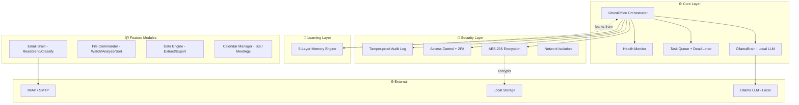

<div align="center">

<!-- LOGO -->


# GhostOffice

**Your Private AI Assistant for Email, Files & Data**

*Works silently. Learns constantly. Never phones home.*

<br/>

[](https://github.com/ravikumarve/OfficeGhost/releases)
[](https://python.org)
[](https://github.com/ravikumarve/OfficeGhost/tree/main/Tests)
[](LICENSE)
[](https://hub.docker.com)
[](#)

<br/>

```
  ██████╗ ██╗  ██╗ ██████╗ ███████╗████████╗ ██████╗ ███████╗███████╗██╗ ██████╗███████╗
 ██╔════╝ ██║  ██║██╔═══██╗██╔════╝╚══██╔══╝██╔═══██╗██╔════╝██╔════╝██║██╔════╝██╔════╝
 ██║  ███╗███████║██║   ██║███████╗   ██║   ██║   ██║█████╗  █████╗  ██║██║     █████╗  
 ██║   ██║██╔══██║██║   ██║╚════██║   ██║   ██║   ██║██╔══╝  ██╔══╝  ██║██║     ██╔══╝  
 ╚██████╔╝██║  ██║╚██████╔╝███████║   ██║   ╚██████╔╝██║     ██║     ██║╚██████╗███████╗
  ╚═════╝ ╚═╝  ╚═╝ ╚═════╝ ╚══════╝   ╚═╝    ╚═════╝ ╚═╝     ╚═╝     ╚═╝ ╚═════╝╚══════╝
```

<br/>

[**Get Started →**](#-quick-start) &nbsp;·&nbsp; [**View Demo**](#-screenshots) &nbsp;·&nbsp; [**Documentation**](#-documentation) &nbsp;·&nbsp; [**Roadmap**](#-roadmap)

---

</div>

## 📋 Table of Contents

- [👻 What is GhostOffice?](#-what-is-ghostoffice)
- [✨ Key Features](#-key-features)
- [🆚 Why GhostOffice?](#-why-ghostoffice)
- [🏗️ Architecture](#-architecture)
- [🚀 Quick Start](#-quick-start)
- [🔐 Security](#-security)
- [📚 Version History](#-version-history)
- [📖 Documentation](#-documentation)
- [🛠️ Development](#-development)
- [🐳 Docker](#-docker)
- [🗺️ Roadmap](#-roadmap)
- [🤝 Contributing](#-contributing)

---

## 👻 What is GhostOffice?

GhostOffice is a **privacy-first, fully local AI assistant** that silently handles your email, files, and data entry — automatically, every day, without sending a single byte to the cloud.

Unlike SaaS tools that charge monthly fees and store your data on their servers, GhostOffice runs entirely on your machine using [Ollama](https://ollama.ai). Your emails, documents, and business data stay **100% yours**.

> *"It just works in the background. Like a ghost."*

<br/>

<div align="center">

| 🛡️ AES-256 Encrypted | 🧠 Self-Learning AI | ☁️ 100% Local | 📱 Web Dashboard | ✅ GDPR / HIPAA |
|:---:|:---:|:---:|:---:|:---:|

</div>

---

## ✨ Key Features

### 📧 Email Automation
- IMAP/SMTP integration — works with Gmail, Outlook, ProtonMail, and any standard email
- AI-powered classification: `URGENT` · `ROUTINE` · `SPAM` · `MEETING`
- Smart reply drafting that **learns your writing style**
- Contact prioritization and relationship tracking
- Customizable email templates system

### 📁 File Management
- Folder watcher with real-time AI content analysis
- Automatic organization into smart categories
- Duplicate detection and cleanup suggestions
- Deep content understanding — not just filenames

### 📊 Data Entry & Extraction
- Invoice and receipt parsing with OCR
- Export directly to Excel, CSV, or Google Sheets
- Batch processing for entire document folders
- Learns your naming conventions and data formats

### 🧠 5-Layer Self-Learning Memory
```
Layer 1 │ Feedback Loop      ── Learns from every correction you make
Layer 2 │ Preference Capture ── Stores your working style and habits  
Layer 3 │ Style Learning     ── Mimics your email tone and voice
Layer 4 │ Pattern Recognition── Detects time-based behavioral patterns
Layer 5 │ Predictions        ── Anticipates your next action
```

### 🔒 Enterprise Security
- AES-256 Fernet encryption with PBKDF2 key derivation (600K iterations)
- Biometric unlock: Windows Hello · Touch ID · Linux PAM
- TOTP 2FA support
- Network isolation modes: `normal` · `isolated` · `air-gapped`
- Tamper-proof audit log with hash chain

### 🌐 Web Dashboard
- Beautiful Flask-based monitoring UI
- Real-time task queue visibility
- System health and Ollama status monitoring
- Prometheus metrics export

---

## 🆚 Why GhostOffice?

<div align="center">

|  | GhostOffice | Zapier / Make | Microsoft Copilot | Notion AI |
|--|:-----------:|:-------------:|:-----------------:|:---------:|
| **100% Local** | ✅ | ❌ | ❌ | ❌ |
| **No Subscription** | ✅ | ❌ | ❌ | ❌ |
| **Your Data Stays Private** | ✅ | ❌ | ❌ | ❌ |
| **Learns Your Style** | ✅ | ❌ | ⚠️ | ⚠️ |
| **Works Offline** | ✅ | ❌ | ❌ | ❌ |
| **GDPR / HIPAA Ready** | ✅ | ⚠️ | ⚠️ | ❌ |
| **Open Source** | ✅ | ❌ | ❌ | ❌ |

</div>

---

## 🏗️ Architecture



---

## 🚀 Quick Start

### Prerequisites

- Python 3.8+
- [Ollama](https://ollama.ai) installed and running
- 4GB+ RAM recommended

### Installation

```bash
# 1. Clone the repository
git clone https://github.com/ravikumarve/OfficeGhost.git
cd OfficeGhost

# 2. Create virtual environment
python3 -m venv venv
source venv/bin/activate        # Linux / Mac
# venv\Scripts\activate         # Windows

# 3. Install dependencies
pip install -r requirements.txt

# 4. Pull a local model (phi3:mini is fast and lightweight)
ollama pull phi3:mini

# 5. Run setup wizard
python3 setup.py

# 6. Configure your settings
cp .env.example .env
nano .env                       # Add your email credentials

# 7. Launch GhostOffice
python3 main.py
```

> ✅ The web dashboard will be available at `http://localhost:5000`

### Docker (Fastest Way)

```bash
# One-command start
docker-compose up -d

# View logs
docker logs -f ghostoffice
```

---

## 🔐 Security

GhostOffice is built with a security-first mindset. Every byte of sensitive data is protected.

### Encryption
| Layer | Method | Detail |
|-------|--------|--------|
| Data at rest | AES-256 Fernet | Industry-standard symmetric encryption |
| Key derivation | PBKDF2-HMAC-SHA256 | 600,000 iterations — brute force resistant |
| Master password | Never stored | Derived at runtime, wiped from memory |
| File deletion | 3-pass overwrite | DoD-standard secure deletion |

### Authentication
- ✅ Master password with strength enforcement
- ✅ TOTP 2FA (Google Authenticator, Authy)
- ✅ Biometric unlock — Windows Hello · Touch ID · Linux PAM
- ✅ Session tokens with automatic refresh and expiry

### Network Security
- ✅ IP allowlisting
- ✅ Configurable rate limiting via `.env`
- ✅ Network isolation modes: `normal` · `isolated` · `air-gapped`
- ✅ Optional VPN auto-connect

### Compliance
- ✅ GDPR Article 17 & 20 (right to erasure, data portability)
- ✅ HIPAA-ready audit trail
- ✅ Tamper-proof hash chain logging
- ✅ Full data export and secure deletion

---

## 📚 Version History

### 🔵 v3.0.0 — "The Enterprise Edition" *(March 2026)*

The most hardened and feature-complete release. Built for teams, freelancers, and privacy-obsessed power users.

**What's new:**
- 138-test suite (135 passing) with full coverage reporting
- Retry logic with exponential backoff for all network operations
- Dead letter queue for failed task recovery
- Email templates system with customizable reply scaffolds
- Calendar integration — `.ics` parsing and meeting automation
- Biometric unlock support across all major OS platforms
- Network isolation and air-gapped operation mode
- Docker multi-stage build optimization
- Prometheus metrics and health monitoring

---

### 🟢 v2.0.0 — "The Learning Edition" *(2025)*

Introduced the 5-layer memory system and AI-powered self-improvement.

**What's new:**
- 5-layer memory engine (feedback, preferences, style, patterns, predictions)
- Smart email classification: URGENT · ROUTINE · SPAM · MEETING
- File Commander Pro with AI content analysis
- Invoice/receipt extraction and spreadsheet export
- Enhanced contact learning and prioritization

---

### ⚪ v1.0.0 — "The Foundation" *(2024)*

The original release. Solid core. Battle-tested security layer.

**What's included:**
- GhostOffice core orchestrator
- AES-256 encryption engine with PBKDF2
- IMAP/SMTP email reader and sender
- File watcher and basic data extraction
- CLI interface
- GDPR / HIPAA compliance groundwork

---

## 📖 Documentation

| Document | Description |
|----------|-------------|
| [README.md](README.md) | Overview and quick start (you are here) |
| [ARCHITECTURE.md](ARCHITECTURE.md) | Detailed system design and module breakdown |
| [docs/DEPLOYMENT.md](docs/DEPLOYMENT.md) | Local, Docker, and production deployment guide |
| [docs/API.md](docs/API.md) | REST API reference |
| [TODO.md](TODO.md) | Development roadmap and progress tracker |

---

## 🛠️ Development

### Project Structure

```
ghostoffice/
├── main.py                     # Entry point + CLI menu
├── setup.py                    # First-run setup wizard
├── Core/                       # Orchestration layer
│   ├── pilot.py               # Main GhostOffice class
│   ├── config.py              # Configuration manager
│   ├── ollama_brain.py        # Local LLM interface
│   ├── queue_manager.py       # Task queue + dead letter
│   ├── health_monitor.py      # System health checks
│   ├── retry.py               # Exponential backoff
│   └── metrics.py             # Prometheus metrics
├── Security/                   # Security layer
│   ├── encryption.py          # AES-256 engine
│   ├── auth.py                # Access control
│   ├── audit.py               # Audit logging
│   ├── biometric.py           # Biometric unlock
│   ├── session.py             # Session management
│   ├── network.py             # Network isolation
│   └── rate_limit.py          # Rate limiting
├── Learning/                   # Self-learning engine
│   └── memory.py              # 5-layer memory system
├── Modules/                    # Feature modules
│   ├── email_brain/           # Email read/send/classify
│   ├── file_commander/        # Watch/analyze/sort files
│   ├── data_engine/           # Extract/export data
│   └── calendar/              # Calendar + meetings
├── Tests/                      # Test suite (138 tests)
├── Dashboard/                  # Flask web dashboard
├── docs/                       # Documentation
└── .env.example                # Config template
```

### Running Tests

```bash
# Run all tests
pytest Tests/

# With coverage report
pytest Tests/ --cov=. --cov-report=term-missing

# Single module
pytest Tests/test_learning.py -v
```

### Code Style

```bash
ruff format .         # Format code
ruff check .          # Lint
pre-commit run --all-files
```

---

## 🐳 Docker

### Quick Start

```bash
# Build and run
docker build -t ghostoffice .

docker run -d \
  --name ghostoffice \
  -p 5000:5000 \
  -v ~/ghostoffice-data:/data \
  -e EMAIL_1_ADDRESS=your@email.com \
  -e EMAIL_1_PASSWORD=your_password \
  ghostoffice
```

### Docker Compose

```yaml
version: '3.8'
services:
  ghostoffice:
    build: .
    container_name: ghostoffice
    ports:
      - "5000:5000"
    volumes:
      - ~/ghostoffice-data:/data
    environment:
      - OLLAMA_HOST=http://host.docker.internal:11434
    restart: unless-stopped
```

---

## 🗺️ Roadmap

| Version | ETA | Features |
|---------|-----|----------|
| **v3.1** | Q2 2026 | Google Calendar API · Multi-language support · Enhanced voice commands |
| **v3.2** | Q3 2026 | Mobile companion app · Slack/Teams integration · Advanced analytics |
| **v4.0** | Q4 2026 | Multi-user support · Team collaboration · Custom model fine-tuning |

---

## 🤝 Contributing

Contributions are welcome! Please read [CONTRIBUTING.md](CONTRIBUTING.md) before submitting a PR.

```bash
# Fork and clone
git clone https://github.com/ravikumarve/OfficeGhost.git
cd OfficeGhost

# Install dev dependencies
pip install -e .[dev]

# Run tests before submitting
pytest Tests/ -v
ruff format .
```

---

## 📄 License

MIT License — see [LICENSE](LICENSE) for details. Free to use, modify, and distribute.

---

<div align="center">

**Built with ❤️ for privacy-focused productivity**

*GhostOffice — your AI assistant that's seen but never heard*

<br/>

[](https://github.com/ravikumarve/OfficeGhost/stargazers)
[](https://github.com/ravikumarve/OfficeGhost/fork)
[](https://github.com/ravikumarve/OfficeGhost/issues)

<br/>

© 2024–2026 GhostOffice · [MIT License](LICENSE)

</div>
